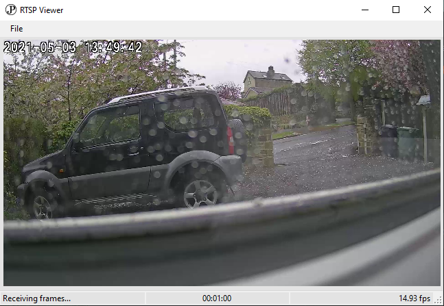

# RTSP Viewer

## Vision
Provide the ability to watch an RTP stream from my security camera without requiring VLC media player.

## Libraries Used
- [RtspClientSharp](https://github.com/BogdanovKirill/RtspClientSharp) - an RTSP client implementation
- [FFmpeg](https://www.ffmpeg.org) - an audio & video conversion
- [NAudio](https://github.com/naudio/NAudio) - a .NET audio library
- [DeviceID](https://github.com/MatthewKing/DeviceId) - unique identifier generation based on computer hardware
- [Newtonsoft.Json](https://github.com/JamesNK/Newtonsoft.Json) - a JSON serialisation library

## Prerequisites to run
.Net Framework 4.8

## Future
It's good enough for what I need right now, here are some of the things I would change about it.
- Allow for multiple streams to run simultaneously
- Use .Net Core if possible, although I had issues calling ffmpeg from it
- Use a different UI such as WPF or UWP
